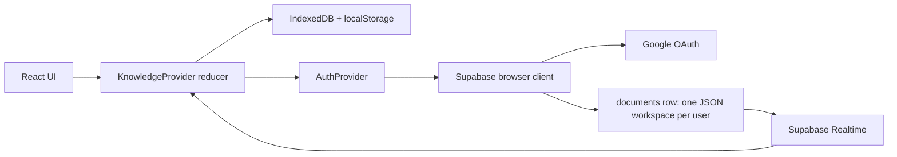

# Backend and persistence architecture

## Boundary summary

Knowledge OS currently has a thin TanStack server boundary and a browser-managed data layer. There is no repository-owned REST/GraphQL API, database migration directory, or server-side domain service.



This architecture is simple and fast for a single-user workspace, but database security depends on correctly configured Supabase Row Level Security because reads and writes happen from the browser.

## Persisted domain model

`src/lib/types.ts` is the source of truth:

```ts
type JSONContent = Record<string, unknown>;

type PageKind = "document" | "whiteboard";

interface KnowledgePage {
  id: string;
  title: string;
  kind?: PageKind;
  icon?: string;
  coverImage?: string;
  avatarImage?: string;
  parentId: string | null;
  childrenIds: string[];
  content: JSONContent;
  whiteboard?: {
    version: 1;
    elements: readonly ExcalidrawElement[];
    appState: Partial<
      Pick<
        AppState,
        | "gridModeEnabled"
        | "gridSize"
        | "gridStep"
        | "scrollX"
        | "scrollY"
        | "viewBackgroundColor"
        | "zoom"
      >
    >;
  };
  createdAt: number;
  updatedAt: number;
}

interface KnowledgeOSState {
  pages: Record<string, KnowledgePage>;
  rootOrder: string[];
  activePageId: string | null;
}
```

The entire `KnowledgeOSState`, including presentation fields and the active selection, is persisted
as one document. Existing pages can omit `kind` and are treated as documents. Whiteboard scene
records have their own version marker, but there is still no workspace-level schema version or
migration function.

Whiteboard persistence intentionally contains no Excalidraw `BinaryFiles`. The image tool, pasted
images, embeds, and imports containing image/embed elements are blocked so a board cannot silently
inflate the full workspace JSON with file data.

## Local persistence

`src/lib/storage.ts` owns local workspace I/O.

| Concern         | Current behavior                                                                              |
| --------------- | --------------------------------------------------------------------------------------------- |
| Database        | IndexedDB database `knowledge-os`, object store `state`                                       |
| Workspace key   | `knowledge-os-state`                                                                          |
| Primary write   | Full state serialized to JSON and stored in IndexedDB                                         |
| Secondary write | Best-effort mirror of the same JSON in localStorage                                           |
| Save timing     | 400 ms debounce after store changes                                                           |
| Load order      | IndexedDB first, then legacy/backup localStorage                                              |
| Migration       | A valid localStorage record is copied into IndexedDB                                          |
| Images          | Document image content and cover/avatar uploads use data URLs; whiteboards reject image files |

IndexedDB operations deliberately fail soft for blocked/private environments. localStorage quota failures also fail soft because IndexedDB remains primary.

Soundscape preferences are a separate versioned, local-only record under `focus-audio-prefs`. Version
2 stores `masterVolume` plus validated layers shaped as `{ id, volume }`; the loader migrates the
legacy track-ID/global-volume record. Playback state is deliberately ephemeral, never autostarts on
load, is not part of the workspace, and does not sync to Supabase.

## Authentication

`src/lib/supabase.ts` creates the browser client from:

- `VITE_SUPABASE_URL`
- `VITE_SUPABASE_ANON_KEY`

Google sign-in uses Supabase OAuth, redirects back to `window.location.origin`, requests account selection, and then relies on Supabase session persistence. `src/lib/auth-context.tsx` exposes the user, loading state, sign-in/sign-out, remote fetch, and remote sync functions.

Never add a service-role key to a `VITE_*` variable or any browser bundle. Do not copy current `.env` values into documentation, logs, issues, or chat output. The repository currently contains a tracked `.env`; treat it as sensitive legacy state and handle any removal or rotation as an explicit security task.

Current constraint: when Supabase is not configured, `onAuthChange` returns a no-op subscription without clearing `AuthProvider.loading`. As written, that prevents `KnowledgeProvider` from finishing local-only hydration. Verify and fix this path before claiming that a build works without Supabase variables.

## Remote document contract

The client expects a Supabase table named `documents` with:

| Column       | Expected contract                                                   |
| ------------ | ------------------------------------------------------------------- |
| `user_id`    | UUID and unique conflict target; identifies the authenticated owner |
| `content`    | JSONB containing the complete `KnowledgeOSState`                    |
| `updated_at` | Timestamp with time zone                                            |

The code performs:

- `.select("content").eq("user_id", userId).maybeSingle()` on load;
- `upsert({ user_id, content, updated_at }, { onConflict: "user_id" })` on save;
- a `postgres_changes` subscription filtered by `user_id`.

No SQL migration, generated Supabase types, RLS policy, index definition, or environment-specific project configuration is version-controlled. Before changing this contract, obtain or add the real schema and policies rather than guessing them.

Minimum security expectation outside this repository:

- RLS is enabled on `documents`;
- authenticated users can select/insert/update only the row whose `user_id` equals `auth.uid()`;
- anonymous users cannot read or mutate another user's workspace.

## Hydration and sync flow

`KnowledgeProvider` orchestrates state:

1. Wait for auth initialization.
2. If signed in, fetch remote state first.
3. If no remote state exists, load local state or seed a welcome page, then upload it.
4. If signed out, load local state or seed a welcome page.
5. Hydrate the reducer and mark it ready.
6. Persist every later state change locally after 400 ms.
7. For a signed-in user, upload the full state after 800 ms.
8. Subscribe to remote row changes and hydrate when the serialized document differs from the last local/remote snapshots.

This is whole-document, last-writer-oriented synchronization. It has no field-level merge, revision number, optimistic concurrency check, deletion tombstones, or offline queue. Multiple active devices can overwrite one another. Any collaboration or multi-device reliability work must start with an explicit conflict model.

## TanStack server and SSR boundary

- `src/start.ts` registers request error handling and restores CSRF middleware for TanStack server functions.
- `src/server.ts` wraps the generated server entry and converts catastrophic/swallowed h3 JSON failures into a stable HTML error page.
- `src/lib/error-capture.ts` preserves useful error/cause information that h3 may otherwise flatten.
- `src/routes/__root.tsx` provides the React error boundary and forwards preview errors to Lovable telemetry.

There are currently no application server functions. If sensitive operations are added, implement them server-side and keep secrets out of the Vite client environment.

## Failure behavior and known risks

- Remote fetch errors log and fall back as though no remote document exists.
- Remote save errors are caught by the store, but the UI receives no durable failure/retry state.
- Syncing serializes and uploads the complete workspace, including data-URL images.
- Whiteboard element arrays share the same whole-document sync and last-writer conflict model.
- There is no data validation when loading local JSON or Supabase `content` beyond shallow shape checks.
- There is no persisted schema version or migration path.
- There are no repository-owned backend integration tests.

Treat data-loss, auth, RLS, conflict, and migration work as high risk. Add recovery/rollback thinking and explicit validation when touching these paths.
